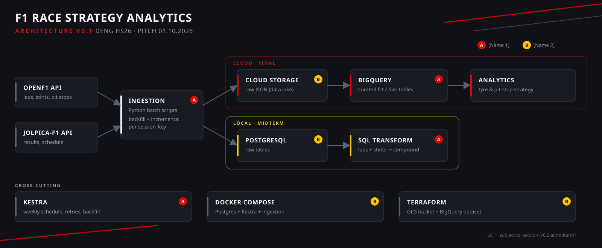

  
**Team:** 06  
**Members:** Florentin Genge · Raphael Wunderlin  
**Module:** Data Engineering (DENG) · Hochschule Luzern · HS26

---

## Use case and target user

**User:** Race strategy analyst (or F1 fantasy league participant) who wants to compare tyre strategies and pit stop timing across drivers and circuits.

**Problem:** Raw F1 timing data is scattered across multiple APIs and hard to query in aggregate. There is no curated dataset that links lap-level pace, tyre compound, stint length, and pit stop timing in a single queryable table.

**Data product:** Curated BigQuery tables enabling queries such as:
- Which tyre compound produces the least degradation per circuit?
- Which team executed the most successful undercuts per season?
- How does lap pace evolve across a stint by compound?

---

## Data sources

| Source | What it provides | Format | Update cadence |
|--------|-----------------|--------|----------------|
| [OpenF1 API](https://openf1.org) | Lap times, stints, pit stops, car telemetry, race control messages, weather | JSON (REST) | After each race weekend |
| [Jolpica-F1 API](https://api.jolpi.ca) | Race results, driver/constructor standings, race schedule | JSON (REST) | After each race weekend |

**Historical coverage:** OpenF1 from 2023; Jolpica from 1950 (results) / 2023 (full detail).  
**Volume estimate:** ~50–200 MB per full season (laps + stints + pit stops), excluding high-frequency telemetry.  
**Known risks:**
- Both APIs are unofficial, community-maintained projects — availability is not guaranteed.
- Schemas may change without notice.
- Jolpica & OpenF1 both have rate limits: 4 req/s and 500 req/h without a token.
- Lap time data may be missing for DNFs, Safety Car periods, or red-flagged sessions.

---

## Architecture v0.1



See [`docs/f1_pipeline_arch_v01.svg`](docs/f1_pipeline_arch_v01.svg) for the full diagram.

---

## Data model (target grain)

| Table | One row represents | Key columns |
|-------|--------------------|-------------|
| `fct_laps` | One lap of one driver in one session | `session_key`, `driver_number`, `lap_number`, `lap_duration_s`, `compound`, `tyre_age_laps` ¹ |
| `fct_stints` | One continuous tyre stint | `session_key`, `driver_number`, `stint_number`, `compound`, `lap_start`, `lap_end`, `tyre_age_at_start` |
| `fct_pit_stops` | One pit stop entry/exit | `session_key`, `driver_number`, `lap_number`, `pit_duration_s`, `compound_in`, `compound_out` ² |
| `dim_drivers` | One driver (slowly changing) | `driver_number`, `full_name`, `team_name`, `nationality` |
| `dim_circuits` | One circuit | `circuit_key`, `circuit_name`, `location`, `country` |
| `dim_sessions` | One race weekend session | `session_key`, `session_type`, `meeting_key`, `date_start` |

> ¹ `compound` and `tyre_age_laps` are not present in the OpenF1 `/laps` endpoint. They are derived by joining laps with the `/stints` endpoint on `(session_key, driver_number, lap_number BETWEEN lap_start AND lap_end)`.
>
> ² `compound_in` and `compound_out` are also not present in the OpenF1 `/pit` endpoint. They are derived from the stints preceding and following each pit stop.
>
> Sample raw API responses for both sources are available in [`docs/sample_data/`](docs/sample_data/).

---

## Ingestion strategy

**Full load (backfill):** On first run, load all available sessions from 2023 to present.  
**Incremental load:** After each race weekend, load only new `session_key` values not yet present in the database. Idempotency is ensured by upserting on `(session_key, driver_number, lap_number)`.  
**Failure handling:** Failed session loads are logged and retried by the Kestra workflow on next run. Partial loads do not corrupt existing data.

---

## Repository structure

```
F1-Race-Strategy-Analytics/
├── README.md
├── .env.example                # Required environment variables (no secrets committed)
├── .gitignore
├── docs/
│   ├── f1_pipeline_arch_v01.svg      # Architecture v0.1
│   └── sample_data/                  # Raw API sample responses (CSV)
│       ├── openf1_laps_sample.csv
│       ├── openf1_stints_sample.csv
│       ├── openf1_pit_sample.csv
│       ├── jolpica_results_sample.csv
│       └── jolpica_pitstops_sample.csv
└── img/                        # Logo and banner used in the README
```

Ingestion, transformation, orchestration, Terraform and Docker Compose code will be added as the project progresses (see backlog).

---

## Setup and reproduction

### Prerequisites

- Docker and Docker Compose
- Python 3.11+
- Google Cloud project with billing enabled (for final milestone)
- Terraform ≥ 1.5 (for final milestone)

### Local pipeline (Milestone 1 / Midterm)

> Planned — the Docker Compose setup and ingestion scripts are not yet in the repository.

```bash
# 1. Clone the repository
git clone https://github.com/F1-RSA/F1-Race-Strategy-Analytics.git
cd F1-Race-Strategy-Analytics

# 2. Copy and fill in environment variables
cp .env.example .env
# Edit .env: set POSTGRES_USER, POSTGRES_PASSWORD, POSTGRES_DB

# 3. Start services
docker compose up -d

# 4. Run a backfill for one season
docker compose exec ingestion python ingest_sessions.py --season 2024

# 5. Verify data in PostgreSQL
docker compose exec db psql -U $POSTGRES_USER -d $POSTGRES_DB \
  -c "SELECT count(*) FROM raw_laps;"
```

### Cloud pipeline (Final milestone)

> Planned — the Terraform code and ingestion scripts are not yet in the repository.

```bash
# Provision GCS bucket and BigQuery dataset
cd terraform
terraform init
terraform plan
terraform apply

# Run full ingestion to cloud
docker compose run ingestion python ingest_sessions.py --season 2024 --target cloud
```

---

## Orchestration

The pipeline is scheduled to run every Monday at 06:00 UTC using Kestra, covering any race weekends from the previous 7 days. The flow:
1. Fetches the current race calendar to identify new `session_key` values.
2. Runs incremental ingestion for each new session (OpenF1 + Jolpica).
3. Uploads raw JSON to GCS.
4. Triggers SQL transformations to update curated tables in BigQuery.
5. On failure: retries up to 3 times with exponential backoff; alerts are logged.

---

## Team responsibilities

| Area | Primary | Secondary |
|------|---------|-----------|
| Ingestion scripts & API clients | Raphael | Florentin |
| PostgreSQL schema & Docker Compose | Florentin | Raphael |
| Kestra orchestration | Raphael | Florentin |
| Terraform & GCP infrastructure | Florentin | Raphael |
| Transformation & data model | Raphael | Florentin |
| Documentation & architecture diagrams | Both | – |

---

## Project backlog (high-level)

| Week | Milestone | Key tasks |
|------|-----------|-----------|
| 3 | Pitch | Repository setup · API exploration · Architecture v0.1 |
| 4–5 | Midterm prep | Ingestion scripts · PostgreSQL schema · Docker Compose · Kestra flow |
| 6 | Midterm submission | Code freeze · Architecture v0.2 · README verification |
| 7 | Midterm defence | Q&A |
| 8–10 | Cloud build | Terraform · GCS upload · BigQuery schema |
| 11–12 | Transformation | dbt models · DQ checks · partitioning decisions |
| 13 | Final submission | Full pipeline test · documentation · known limitations |
| 14 | Final defence | Q&A |

---

## Known limitations and risks

- OpenF1 and Jolpica are unofficial APIs; downtime or schema changes are outside our control.
- Telemetry data (car_data at 3.7 Hz) is excluded from the main pipeline due to volume; may be loaded selectively for specific sessions.
- Jolpica rate limits require deliberate throttling; initial backfill may take several hours.
- Pre-2023 data (Jolpica results) has lower detail granularity than 2023+ OpenF1 sessions.
- Jolpica returns pit stop `duration` as a string (e.g. `"24.418"`), not a numeric type — explicit casting is required during ingestion.

---

*Architecture v0.1 – 01.10.2026 | Subject to revision after implementation experience*
