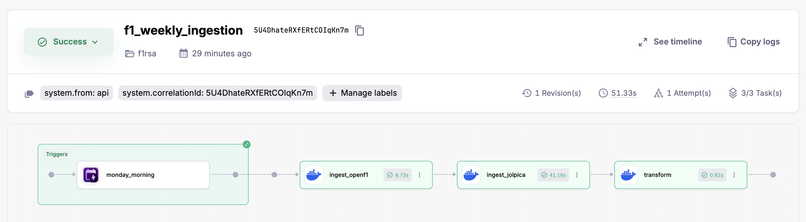

  
**Team:** 06  
**Members:** Florentin Genge · Raphael Wunderlin  
**Module:** Data Engineering (DENG) · Hochschule Luzern · HS26

---

## Use case and target user

**User:** Race strategy analyst (or F1 fantasy league participant) who wants to compare tyre strategies and pit stop timing across drivers and circuits.

**Problem:** Raw F1 timing data is scattered across multiple APIs and hard to query in aggregate. There is no curated dataset that links lap-level pace, tyre compound, stint length, and pit stop timing in a single queryable table.

**Data product:** Curated BigQuery tables enabling queries such as:
- Which tyre compound produces the least degradation per circuit?
- Which team executed the most successful undercuts per season?
- How does lap pace evolve across a stint by compound?

---

## Data sources

| Source | What it provides | Format | Update cadence |
|--------|-----------------|--------|----------------|
| [OpenF1 API](https://openf1.org) | Lap times, stints, pit stops, car telemetry, race control messages, weather | JSON (REST) | After each race weekend |
| [Jolpica-F1 API](https://api.jolpi.ca) | Race results, driver/constructor standings, race schedule | JSON (REST) | After each race weekend |

**Historical coverage:** OpenF1 from 2023; Jolpica from 1950 (results) / 2023 (full detail).  
**Volume estimate:** ~50–200 MB per full season (laps + stints + pit stops), excluding high-frequency telemetry.  
**Known risks:**
- Both APIs are unofficial, community-maintained projects — availability is not guaranteed.
- Schemas may change without notice.
- Rate limits: OpenF1 neither documents a limit nor sends rate-limit headers (checked 2026-10-19), so the client throttles itself to 24 req/min (configurable). Jolpica allows 4 req/s and 500 req/h (to be verified in M5).
- Lap time data may be missing for DNFs, Safety Car periods, or red-flagged sessions.

---

## Architecture v0.1


See [`docs/f1_pipeline_arch_v01.svg`](docs/f1_pipeline_arch_v01.svg) for the full diagram.

---

## Data model (target grain)

| Table | One row represents | Key columns |
|-------|--------------------|-------------|
| `fct_laps` | One lap of one driver in one session | `session_key`, `driver_number`, `lap_number`, `lap_duration_s`, `compound`, `tyre_age_laps` ¹ |
| `fct_stints` | One continuous tyre stint | `session_key`, `driver_number`, `stint_number`, `compound`, `lap_start`, `lap_end`, `tyre_age_at_start` |
| `fct_pit_stops` | One pit stop entry/exit | `session_key`, `driver_number`, `lap_number`, `pit_duration_s`, `compound_in`, `compound_out` ² |
| `dim_drivers` | One driver (slowly changing) | `driver_number`, `full_name`, `team_name`, `nationality` |
| `dim_circuits` | One circuit | `circuit_key`, `circuit_name`, `location`, `country` |
| `dim_sessions` | One race weekend session | `session_key`, `session_type`, `meeting_key`, `date_start` |

> ¹ `compound` and `tyre_age_laps` are not present in the OpenF1 `/laps` endpoint. They are derived by joining laps with the `/stints` endpoint on `(session_key, driver_number, lap_number BETWEEN lap_start AND lap_end)`. The midterm implements this as the view `core.laps_enriched`; the overlap rule is in [docs/data_model.md](docs/data_model.md).
>
> ² `compound_in` and `compound_out` are also not present in the OpenF1 `/pit` endpoint. They are derived from the stints preceding and following each pit stop.
>
> Sample raw API responses for both sources are available in [`docs/sample_data/`](docs/sample_data/).

---

## Ingestion strategy

**Full load (backfill):** On first run, load all available sessions from 2023 to present.  
**Incremental load:** After each race weekend, load only new `session_key` values not yet present in the database. Idempotency is ensured by upserting on the natural key of each raw table (for laps `(session_key, driver_number, lap_number)`).  
**Failure handling:** Failed session loads are logged and retried by the Kestra workflow on next run. Partial loads do not corrupt existing data.

---

## Repository structure

```
F1-Race-Strategy-Analytics/
├── README.md
├── docker-compose.yml          # PostgreSQL, Kestra (with its own database) and the ingestion image on one network
├── .env.example                # All configuration; the defaults work unchanged
├── .gitignore
├── db/init/                    # Schema scripts (schemas, raw tables, load log), run on first start
├── ingestion/
│   ├── Dockerfile              # Image with the package installed; stays idle for docker compose exec
│   ├── pyproject.toml          # Package, pinned dependencies, ruff and pytest config
│   ├── f1_ingest/
│   │   ├── cli.py              # Command line: source, season / session-key, mode, target
│   │   ├── config.py           # Settings from environment variables
│   │   ├── http.py             # Token bucket rate limiter, retry with backoff
│   │   ├── jolpica.py          # Jolpica client: season schedule and results, pagination
│   │   ├── jolpica_load.py     # Jolpica load: schedule, completed rounds, one row per result
│   │   ├── openf1.py           # OpenF1 client: session listing, drivers, laps, stints, pit
│   │   ├── pipeline.py         # Session selection (incremental, unfinished) and per-session load
│   │   ├── transform.py        # Builds core.laps_enriched, grain and coverage checks
│   │   ├── sql/                # SQL of the transformation (installed with the package)
│   │   ├── state.py            # meta.load_log: attempts and the "loaded" rule
│   │   └── sinks/postgres.py   # Upsert into raw.* on the natural keys
│   └── tests/                  # Offline tests, plus `integration` tests that need the compose db
├── docs/
│   ├── data_model.md                 # Schemas, keys, the load log and core.laps_enriched
│   ├── queries/                      # Example queries with real results
│   ├── decisions.md                  # Decision log per work package
│   ├── f1_pipeline_arch_v01.svg      # Architecture v0.1
│   └── sample_data/                  # Raw API sample responses (CSV)
├── flows/
│   └── f1_weekly_ingestion.yml       # Kestra flow, loaded automatically at startup
├── sql/                        # Empty placeholder (the transformation SQL lives in ingestion/f1_ingest/sql/)
└── img/                        # Logo and banner used in the README
```

The dbt models and Terraform are added in later work packages (see backlog).

---

## Setup and reproduction

### Prerequisites

- Docker and Docker Compose
- Python 3.11+ (to run the ingestion tests on the host; if `python3 --version` is older, use `python3.11`)
- Google Cloud project with billing enabled (for final milestone)
- Terraform ≥ 1.5 (for final milestone)

### Local pipeline (Milestone 1 / Midterm)

```bash
# 1. Clone the repository
git clone https://github.com/F1-RSA/F1-Race-Strategy-Analytics.git
cd F1-Race-Strategy-Analytics

# 2. Create the environment file (the defaults work for local development)
cp .env.example .env

# 3. Build and start all services
docker compose up -d --build

# 4. Check that everything is healthy
docker compose ps

# 5. Verify the database connection from inside the network
docker compose exec ingestion python -c "import socket; socket.create_connection(('db', 5432), 3); print('db reachable')"
docker compose exec db psql -U f1 -d f1_db -c "SELECT 1;"

# 6. Check that the schema was created
docker compose exec db psql -U f1 -d f1_db -c "\dt raw.*" -c "\dt meta.*"
```

Expected: `f1_postgres` and `f1_kestra_postgres` show `healthy`, `f1_kestra` and `f1_ingestion` show `Up` (the first start pulls the Kestra image, about 4 GB; allow a few minutes), the connection checks print `db reachable` and a single row with `1`, and the last command lists the tables `raw.meetings`, `raw.sessions`, `raw.drivers`, `raw.laps`, `raw.stints`, `raw.pit`, `raw.jolpica_races`, `raw.jolpica_results` and `meta.load_log`. The tables are created by `db/init/` on the first start with an empty volume; see [docs/data_model.md](docs/data_model.md) for the keys.

> **Existing databases:** Postgres runs the scripts in `db/init/` only when the data volume is empty. A database created before the Jolpica tables were added (`04_raw_jolpica.sql`) does not have them, and the step-6 check lists only the OpenF1 tables. Recreate it with `docker compose down -v && docker compose up -d --build`; this deletes all loaded data, which a rerun of the ingestion restores.

To stop the services, run `docker compose down`. To also delete the database volume (fresh start), run `docker compose down -v`.

### Load data with the ingestion CLI

The commands run inside the ingestion container, which has the package installed. They read the live OpenF1 API (**needs network**) and write to the `raw.*` tables and `meta.load_log`. The client allows 24 requests per minute, so one race takes about 8 seconds.

```bash
# Load the first finished race weekend of 2024 (Bahrain Grand Prix, session_key 9472)
docker compose exec ingestion python -m f1_ingest.cli --season 2024 --meeting-limit 1
```

Expected: the log ends with `1 loaded, 0 already loaded, 0 not ready, 0 failed` and the command exits with code 0.

| Option | Meaning |
|--------|---------|
| `--season YEAR` or `--session-key KEY` | One of them is required. A season loads its finished sessions; a key loads that one session (it must be finished) |
| `--source openf1` (default) / `jolpica` | `jolpica` loads races and results of `--season`, see [below](#load-jolpica-race-results); it takes no `--session-key`, `--session-type` or `--meeting-limit` |
| `--mode incremental` (default) | Skip sessions that are already loaded |
| `--mode full` | Reload every selected session (safe, the writes are upserts) |
| `--meeting-limit N` | With `--season`: only the first N finished race weekends of the season. The same command twice changes nothing; a larger N adds the new weekends |
| `--session-type TYPE` | With `--season`, repeatable. Default `Race`, which in OpenF1 includes the Sprint |
| `--transform` | After loading OpenF1 data, build `core.laps_enriched` and run its checks, see [below](#transform-lap-stint-join-and-checks) |
| `--target local` (default) / `cloud` | `cloud` stops with "not implemented yet (final milestone)" |

`python -m f1_ingest.cli --help` lists the same options. Exit code: `0` all sessions ok, `1` at least one session failed (the others are still tried), `2` invalid use, bad configuration or database not reachable.

Verify the result in PostgreSQL:

```bash
# Rows per table
docker compose exec db psql -U f1 -d f1_db -c "SELECT 'sessions' AS tbl, count(*) FROM raw.sessions UNION ALL SELECT 'drivers', count(*) FROM raw.drivers UNION ALL SELECT 'laps', count(*) FROM raw.laps UNION ALL SELECT 'stints', count(*) FROM raw.stints UNION ALL SELECT 'pit', count(*) FROM raw.pit;"

# Duplicate keys (the primary keys make them impossible; 0 shows the upserts did not need a second row)
docker compose exec db psql -U f1 -d f1_db -c "SELECT 'laps' AS tbl, count(*) AS duplicate_keys FROM (SELECT 1 FROM raw.laps GROUP BY session_key, driver_number, lap_number HAVING count(*) > 1) d UNION ALL SELECT 'pit', count(*) FROM (SELECT 1 FROM raw.pit GROUP BY session_key, driver_number, date HAVING count(*) > 1) d;"

# Load log: attempts per session and endpoint
docker compose exec db psql -U f1 -d f1_db -c "SELECT session_key, endpoint, status, count(*) AS attempts, max(row_count) AS row_count FROM meta.load_log WHERE source = 'openf1' GROUP BY session_key, endpoint, status ORDER BY session_key, min(log_id);"

# Sessions that count as loaded (all five endpoints succeeded)
docker compose exec db psql -U f1 -d f1_db -c "SELECT session_key FROM meta.load_log WHERE source = 'openf1' AND status = 'success' GROUP BY session_key HAVING count(DISTINCT endpoint) = 5;"
```

Expected after the first command (counts can change if OpenF1 corrects its data):

| tbl | count |
|-----|-------|
| sessions | 1 |
| drivers | 20 |
| laps | 1129 |
| stints | 63 |
| pit | 43 |

`duplicate_keys` is `0` for `laps` and `pit`. The load log has five `success` rows for `9472` (`sessions` 1, `drivers` 20, `laps` 1129, `stints` 63, `pit` 43 rows) and the last query returns `9472`.

**Rerun is safe.** Repeat the first command: it logs `0 loaded, 1 already loaded` and nothing changes. Force a reload and check the queries again:

```bash
docker compose exec ingestion python -m f1_ingest.cli --season 2024 --meeting-limit 1 --mode full
```

Expected: `1 loaded`, the same row counts as above, still no duplicate keys, and the load log shows `attempts` 2 for every endpoint of `9472`. Only `_run_id` and `_ingested_at` of the rows change.

**Load only what is new.** Raise the limit to add the second weekend (Saudi Arabian Grand Prix, `9480`):

```bash
docker compose exec ingestion python -m f1_ingest.cli --season 2024 --meeting-limit 2
```

Expected: `1 loaded, 1 already loaded`; rows per table: sessions 2, drivers 40, laps 2031, stints 102, pit 62.

**Abort and resume.** Kill a run in the middle of a session (6 seconds after the start), look at the log, then run the same command again:

```bash
docker compose exec ingestion timeout -s KILL 6 python -m f1_ingest.cli --season 2024 --meeting-limit 3
docker compose exec db psql -U f1 -d f1_db -c "SELECT endpoint, status, row_count FROM meta.load_log WHERE session_key = 9488 ORDER BY log_id;"
docker compose exec ingestion python -m f1_ingest.cli --season 2024 --meeting-limit 3
```

Expected after the kill: the first command prints its progress log and ends with exit code `137` (killed); the endpoints that finished are `success`, the one being loaded is still `running`, later ones are missing (in our run `pit` was `running`). The session `9488` is therefore not loaded. The second run logs `marked 1 unfinished log rows of earlier runs as failed`, reloads `9488` and ends with `1 loaded, 2 already loaded`. Final rows per table: sessions 3, drivers 59, laps 3029, stints 157, pit 98. The log keeps both attempts (`failed` and `success` for `pit`).

Other uses: `--season 2024` loads all 30 Race and Sprint sessions of the season (about 8 seconds each); `--session-key 9472 --mode full` reloads one session. Session keys can be found with `https://api.openf1.org/v1/sessions?year=2024&session_type=Race`. To start from an empty database, run `docker compose down -v` and start again.

### Load Jolpica race results

Jolpica (an Ergast-compatible API) delivers the official race results: finishing position, points, grid, status and fastest lap per driver and race. `--source jolpica` loads one season into `raw.jolpica_races` (the schedule) and `raw.jolpica_results` (one row per driver and race). It needs the Jolpica tables, so a database that was created before M5 must be recreated first (**this deletes its data**): `docker compose down -v && docker compose up -d --build`. The client sends about 6 requests per season (one for the schedule, the results in pages of 100 rows) at no more than 6 per minute, so a season takes under a minute.

```bash
# Load 2024: 24 races, results of every completed round
docker compose exec ingestion python -m f1_ingest.cli --source jolpica --season 2024
```

Expected: the log ends with `season 2024, 24 races in schedule, 24 rounds loaded, 0 already loaded, 0 without results yet, 0 not started, 0 failed` and the command exits with code 0. Only rounds whose race has started are loaded: in a running season the later rounds appear as `not started`, and a round that is over but has no published results yet as `without results yet` (a later run loads it).

```bash
# Races and results loaded (the API reports 479 result rows for 2024 in MRData.total)
docker compose exec db psql -U f1 -d f1_db -c "SELECT (SELECT count(*) FROM raw.jolpica_races) AS races, (SELECT count(*) FROM raw.jolpica_results) AS results;"

# Rounds that do not have 20 results (the grid has 20 cars; in 2024 round 3 has 19)
docker compose exec db psql -U f1 -d f1_db -c "SELECT round, count(*) AS results FROM raw.jolpica_results GROUP BY round HAVING count(*) <> 20 ORDER BY round;"

# Duplicate keys and duplicate positions within a race (0 and 0)
docker compose exec db psql -U f1 -d f1_db -c "SELECT count(*) - count(DISTINCT (season, round, driver_id)) AS duplicate_keys, count(*) - count(DISTINCT (round, payload#>>'{Results,0,position}')) AS duplicate_positions FROM raw.jolpica_results;"

# Plausibility: race winners of the first four rounds, and the championship top 3
docker compose exec db psql -U f1 -d f1_db -c "SELECT round, payload->>'raceName' AS race, payload#>>'{Results,0,Driver,code}' AS winner FROM raw.jolpica_results WHERE payload#>>'{Results,0,position}' = '1' ORDER BY round LIMIT 4;"
docker compose exec db psql -U f1 -d f1_db -c "SELECT payload#>>'{Results,0,Driver,code}' AS driver, sum((payload#>>'{Results,0,points}')::numeric) AS points FROM raw.jolpica_results GROUP BY 1 ORDER BY 2 DESC LIMIT 3;"
```

Expected: `races` 24 and `results` 479; round 3 with 19 results is the only row of the second query; `duplicate_keys` 0 and `duplicate_positions` 0; winners VER, VER, SAI, VER (Bahrain, Saudi Arabia, Australia, Japan); top 3 VER 399, NOR 344, LEC 327. The points are lower than the official championship (Verstappen 437) because the sprint races are a separate Jolpica endpoint that is not loaded.

**Rerun is safe.** The second command loads nothing (and makes only the schedule request); `--mode full` rewrites every completed round, and the counts above stay as they are:

```bash
docker compose exec ingestion python -m f1_ingest.cli --source jolpica --season 2024
docker compose exec ingestion python -m f1_ingest.cli --source jolpica --season 2024 --mode full
```

Expected: `0 rounds loaded, 24 already loaded` for the first, `24 rounds loaded, 0 already loaded` for the second, and the same row counts and zero duplicates afterwards.

**A running season.** `--season 2026` loads only the rounds that are over (17 of 23 on 2026-10-21, 22 results each) and a repeated run adds nothing until the next race has been published:

```bash
docker compose exec ingestion python -m f1_ingest.cli --source jolpica --season 2026
```

Which unit counts as loaded is recorded in `meta.load_log` (`source = 'jolpica'`): the unit is part of the `endpoint` text, `races:2024`, `results:2024` (the paginated fetch) and `results:2024:7` (round 7, written together with its rows).

### Transform: lap-stint join and checks

OpenF1's `/laps` has no tyre compound; `/stints` has it per lap range. The transformation joins them into the view `core.laps_enriched` (one row per lap, typed columns: lap time, compound, stint, tyre age in laps, pit-out and lap-time flags) and checks the result. Columns and the join rule are in [docs/data_model.md](docs/data_model.md). The view needs no data of its own, so running the transform again is always safe.

```bash
# Load three race weekends of 2024 (Bahrain, Saudi Arabia, Australia) and run the transform
docker compose exec ingestion python -m f1_ingest.cli --season 2024 --meeting-limit 3 --transform

# The transform alone (after any load, repeatable)
docker compose exec ingestion python -m f1_ingest.transform
```

Expected: the log ends with the checks and the command exits with code 0:

```
grain check passed: 3029 laps, no duplicate key
coverage session 9472: 1129 laps, 0 without stint (0.00 %), 0 without known compound, 0 without tyre age, 0 without lap time
coverage session 9480: 902 laps, 2 without stint (0.22 %), 2 without known compound, 2 without tyre age, 2 without lap time
coverage session 9488: 998 laps, 3 without stint (0.30 %), 3 without known compound, 3 without tyre age, 4 without lap time
coverage total: 3029 laps, 5 without stint (0.17 %), 5 without known compound, 5 without tyre age, 6 without lap time
```

- **Grain check:** no lap appears twice and the view has as many rows as `raw.laps`. A failure is logged as an error and the exit code is `1`.
- **Coverage report:** laps without a stint, known compound, tyre age and lap time, per session and in total. It never fails the run; it warns if more than 2 % of the laps of a session have no stint.

Verify in PostgreSQL:

```bash
# Same number of rows as raw.laps (3029 and 3029)
docker compose exec db psql -U f1 -d f1_db -c "SELECT (SELECT count(*) FROM core.laps_enriched) AS laps_enriched, (SELECT count(*) FROM raw.laps) AS raw_laps;"

# Laps that have a stint but no compound or tyre age (0)
docker compose exec db psql -U f1 -d f1_db -c "SELECT count(*) AS laps_with_stint_but_null FROM core.laps_enriched WHERE stint_number IS NOT NULL AND (compound IS NULL OR tyre_age_laps IS NULL);"

# Why the join takes the earliest stint: laps that a plain BETWEEN join returns twice (0, 0 and 36)
docker compose exec db psql -U f1 -d f1_db -c "SELECT l.session_key, count(*) - count(DISTINCT (l.driver_number, l.lap_number)) AS laps_returned_twice FROM raw.laps l JOIN raw.stints s ON s.session_key = l.session_key AND s.driver_number = l.driver_number AND l.lap_number BETWEEN (s.payload->>'lap_start')::int AND (s.payload->>'lap_end')::int GROUP BY 1 ORDER BY 1;"

# One of those laps: driver 27, Australia. Stint 1 ends and stint 2 starts on lap 17; lap 17 stays HARD
docker compose exec db psql -U f1 -d f1_db -c "SELECT lap_number, stint_number, compound, tyre_age_laps, is_pit_out_lap FROM core.laps_enriched WHERE session_key = 9488 AND driver_number = 27 AND lap_number BETWEEN 15 AND 19 ORDER BY lap_number;"
```

Expected: `3029 | 3029`; `0`; `0, 0, 36` for 9472, 9480 and 9488; and for driver 27 laps 15 to 17 `HARD` (stint 1, tyre age 14 to 16), laps 18 and 19 `MEDIUM` (stint 2, tyre age 1 and 2, lap 18 is the pit-out lap).

The example queries for the use case are in [docs/queries/](docs/queries/): average lap time by compound and tyre age, and degradation per stint. Each file has its explanation and the real result. Run one with `docker compose exec -T db psql -U f1 -d f1_db < docs/queries/degradation_per_stint.sql`.

**Rerun is safe.** Run the transform again: the counts, the compounds and the sums stay the same.

```bash
docker compose exec ingestion python -m f1_ingest.transform
docker compose exec db psql -U f1 -d f1_db -c "SELECT count(*) AS laps, count(compound) AS with_compound, sum(tyre_age_laps) AS tyre_age_sum FROM core.laps_enriched;"
```

Expected: `3029 | 3024 | 37878`, as after the first run.

### Ingestion package: lint, tests and OpenF1 smoke run

The ingestion package runs on the host in a virtual environment. Run all commands from the repository root (on Windows, activate with `.venv\Scripts\activate`).

```bash
# 1. Create a virtual environment and install the package with its dev tools (ruff, pytest)
python3.11 -m venv .venv
source .venv/bin/activate
pip install -e "./ingestion[dev]"

# 2. Lint and check formatting
ruff check ingestion
ruff format --check ingestion

# 3. Run the tests (offline: recorded fixtures, network access is blocked)
pytest ingestion
```

Expected: `All checks passed!`, `18 files already formatted` and `91 passed, 21 deselected`.

The 21 deselected tests are the `integration` tests. They need the compose database and run in a throwaway database (`f1_test_<random>`, created and dropped by the tests, with the unchanged scripts from `db/init/`), so the data in `f1_db` is never touched. Start the database, load the settings from `.env` (its `POSTGRES_HOST=db` only resolves inside the compose network, so override it) and select them with the marker:

```bash
docker compose up -d db
set -a; source .env; set +a
POSTGRES_HOST=localhost pytest ingestion -m integration
```

Expected: `21 passed, 91 deselected`. If the database is not reachable the tests are skipped with the reason, never failed.

Smoke run against the live OpenF1 API (**needs network**). It fetches all five endpoints for one finished race (2024 Bahrain Grand Prix, `session_key` 9472) with five requests and takes about 10 seconds because of the rate limiter. Settings come from environment variables; if none are set, the defaults from `.env.example` apply.

```bash
python - <<'EOF'
import logging
from f1_ingest.config import Settings
from f1_ingest.openf1 import OpenF1Client

logging.basicConfig(level=logging.INFO, format="%(levelname)s %(name)s: %(message)s")
with OpenF1Client.from_settings(Settings.from_env()) as client:
    data = client.fetch_session(9472)
print({endpoint: len(records) for endpoint, records in data.items()})
EOF
```

Expected last line: `{'sessions': 1, 'drivers': 20, 'laps': 1129, 'stints': 63, 'pit': 43}` (counts can change if OpenF1 corrects its data).

The ingestion image contains the package (installed with its pinned direct dependencies), so the CLI runs with `docker compose exec`. After changing the code, rebuild with `docker compose up -d --build`. The image never contains the tests (`ingestion/.dockerignore`); they run on the host and later in CI.

### Cloud pipeline (Final milestone)

> Planned — the Terraform code and the cloud sink are not yet in the repository.

```bash
# Provision GCS bucket and BigQuery dataset
cd terraform
terraform init
terraform plan
terraform apply

# Run full ingestion to cloud
docker compose run ingestion python -m f1_ingest.cli --season 2024 --target cloud
```

---

## Orchestration

Kestra runs the pipeline. The flow [`flows/f1_weekly_ingestion.yml`](flows/f1_weekly_ingestion.yml) is mounted into the Kestra container and loaded at startup (`server standalone --flow-path /app/flows`), so nothing is created by hand in the UI. Kestra keeps its own metadata in a separate Postgres (`kestra_db`); the F1 data stays in `db`.

Every run starts three one-shot containers from the ingestion image (`f1-ingestion:local`) on the compose network `f1_network`, so the host name `db` resolves:

1. `ingest_openf1`: `python -m f1_ingest.cli --season <season> --mode <mode> [--meeting-limit N]` (or `--session-key`).
2. `ingest_jolpica`: `python -m f1_ingest.cli --source jolpica --season <season>` (skipped if `include_jolpica` is off).
3. `transform`: `python -m f1_ingest.transform` rebuilds `core.laps_enriched` and runs its checks.

| Input | Default | Meaning |
|-------|---------|---------|
| `season` | 2024 | Season to load (ignored if `session_key` is set) |
| `session_key` | empty | Load only this OpenF1 session |
| `mode` | `incremental` | `incremental` skips what is loaded, `full` reloads and overwrites |
| `target` | `local` | Only `local` exists until the cloud milestone |
| `meeting_limit` | empty | Only the first N race weekends (small test runs, backfill) |
| `include_jolpica` | on | Also load the Jolpica race results |

**Schedule:** every Monday 06:00 UTC with the season of that day and `mode=incremental`, so it loads what finished since the last run. **Concurrency:** one run at a time, a second one waits in the queue. **Retries:** each load task is tried up to 3 times with exponential backoff (30 s, then 60 s). If a task still fails, the flow ends `FAILED` and `transform` does not run.

### Start Kestra and run the flow

```bash
cp .env.example .env
docker compose up -d --build
docker compose ps
```

Open http://localhost:8080 and log in with the local-development values from `.env` (`KESTRA_USER` / `KESTRA_PASSWORD`, default `admin@kestra.local` / `Kestra_local_dev1`). Under **Flows** the namespace `f1rsa` holds `f1_weekly_ingestion`; Kestra also lists its own `tutorial` example flows, ignore them.

**Manual run:** open the flow, click **Execute**, enter `season` = 2024 and `meeting_limit` = 1, click **Execute**. Expected: the three tasks turn green (first run: OpenF1 about 10 s for one weekend, Jolpica between 40 seconds and 3.5 minutes because of its rate limit). The same run from the command line:

```bash
curl -s -u admin@kestra.local:Kestra_local_dev1 -X POST \
  http://127.0.0.1:8080/api/v1/main/executions/f1rsa/f1_weekly_ingestion \
  -F season=2024 -F meeting_limit=1
```

**Rerun:** execute the flow again with the same inputs. Expected: green, the OpenF1 log says `0 loaded, 1 already loaded`, Jolpica `0 rounds loaded, 24 already loaded`, and the counts below stay the same. `mode` = `full` rewrites the rows instead of skipping them and still leaves the counts unchanged.

**Backfill of a past season:** execute with `season` = 2023, `mode` = `incremental`. Add `meeting_limit` = 1 to try it on one weekend; leave it empty for the whole season (about 30 sessions, a few minutes; Jolpica adds up to 3.5 minutes). Running it again loads only what is missing.

Check the result in the database:

```bash
docker compose exec db psql -U f1 -d f1_db -c "
SELECT 'raw.sessions' AS t, count(*) FROM raw.sessions UNION ALL
SELECT 'raw.laps', count(*) FROM raw.laps UNION ALL
SELECT 'raw.stints', count(*) FROM raw.stints UNION ALL
SELECT 'raw.pit', count(*) FROM raw.pit UNION ALL
SELECT 'raw.jolpica_results', count(*) FROM raw.jolpica_results UNION ALL
SELECT 'core.laps_enriched', count(*) FROM core.laps_enriched;"
docker compose exec db psql -U f1 -d f1_db -c "SELECT source, split_part(endpoint, ':', 1) AS endpoint, status, count(*) FROM meta.load_log GROUP BY 1, 2, 3 ORDER BY 1, 2, 3;"
```

Expected on a fresh database after `season` = 2024 with `meeting_limit` = 1 (and unchanged after a rerun): `raw.sessions` 1, `raw.laps` 1129, `raw.stints` 63, `raw.pit` 43, `raw.jolpica_results` 479, `core.laps_enriched` 1129. A backfill of 2023 with `meeting_limit` = 1 then gives 2 sessions, 2187 laps, 133 stints, 43 pit rows (the 2023 weekend has none in OpenF1), 919 Jolpica results and 2187 rows in `core.laps_enriched`; running it again changes nothing. The load log shows `success` rows only.



**Changing the flow:** edit `flows/f1_weekly_ingestion.yml` and run `docker compose restart kestra`; flows are loaded at startup only. **Docker socket:** Kestra needs `/var/run/docker.sock` to start the ingestion containers, which gives it control of the host's Docker. That is acceptable for a local setup and is the reason the UI is bound to `127.0.0.1`; see `docs/decisions.md` (M7). Log lines from the CLI appear with level ERROR in Kestra because Python logs to stderr; the task state is what counts.

---

## Team responsibilities

| Area | Primary | Secondary |
|------|---------|-----------|
| Ingestion scripts & API clients | Raphael | Florentin |
| PostgreSQL schema & Docker Compose | Florentin | Raphael |
| Kestra orchestration | Raphael | Florentin |
| Terraform & GCP infrastructure | Florentin | Raphael |
| Transformation & data model | Raphael | Florentin |
| Documentation & architecture diagrams | Both | – |

---

## Project backlog (high-level)

| Week | Milestone | Key tasks |
|------|-----------|-----------|
| 3 | Pitch | Repository setup · API exploration · Architecture v0.1 |
| 4–5 | Midterm prep | Ingestion scripts · PostgreSQL schema · Docker Compose · Kestra flow |
| 6 | Midterm submission | Code freeze · Architecture v0.2 · README verification |
| 7 | Midterm defence | Q&A |
| 8–10 | Cloud build | Terraform · GCS upload · BigQuery schema |
| 11–12 | Transformation | dbt models · DQ checks · partitioning decisions |
| 13 | Final submission | Full pipeline test · documentation · known limitations |
| 14 | Final defence | Q&A |

---

## Known limitations and risks

- OpenF1 and Jolpica are unofficial APIs; downtime or schema changes are outside our control.
- Telemetry data (car_data at 3.7 Hz) is excluded from the main pipeline due to volume; may be loaded selectively for specific sessions.
- Jolpica rate limits require deliberate throttling; initial backfill may take several hours.
- Pre-2023 data (Jolpica results) has lower detail granularity than 2023+ OpenF1 sessions.
- Jolpica returns pit stop `duration` as a string (e.g. `"24.418"`), not a numeric type — explicit casting is required during ingestion.

---

*Architecture v0.1 – 01.10.2026 | Subject to revision after implementation experience*
